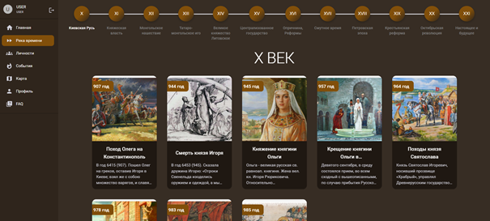

📜 Project is an educational platform for studying Russian history, focused on providing users with an interactive and convenient experience. The platform supports multiple roles, allowing users to publish materials, comment, take tests and view profiles. An interactive map is included to visualize historical events and places. The user interface is adaptive and provides comfortable interaction with content. A validation and form security system is implemented to protect data. The platform is optimized for stable operation and fast loading, ensuring high performance and quality user experience.

<h2> 🧰 Languages and Tools </h2>

 

<h2> 📱 Interface </h2>

<h3> 🏠 Home page  </h3>

<h3> ⏳ The River of Time </h3>

<h3> 🃏 Training card </h3>

<h3> 🗺️ Map page </h3>

<h3> 👨‍💼 Profile page </h3>

<h3> ✍🏼 Create training card </h3>

 
